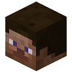

#SkinTools
Skins have never been this fun to mess around with!

###Commands:
Main command: **skintools**, **st**

|Sub-command|Description|
|-----------|-----------|
|**file**|Saves the specified player's skin as a data file|
|**help**|Shows all SkinTools commands|
|**image**|Saves the specified player's skin as an image|
|**morph**|Sets user's skin to that of the specified player's|
|**restore**|Restores user's skin to the skin they joined with|
|**swap**|Swaps skins with the specified player|
|**touch**|Toggles touch mode|

###Permissions:
|Node|Default|
|----|:-------:|
|skintools.command.skintools|op|

###Releases:
|Version|Release Date|Download|
|:-------:|------------|:--------:|
|1.0.0|August 13, 2015|[available](http://forums.pocketmine.net/plugins/skintools.1364/download?version=2607)|
|1.1.0|December 25, 2015|[available](http://forums.pocketmine.net/plugins/skintools.1364/download?version=2984)|
|1.2.0|?|unavailable|